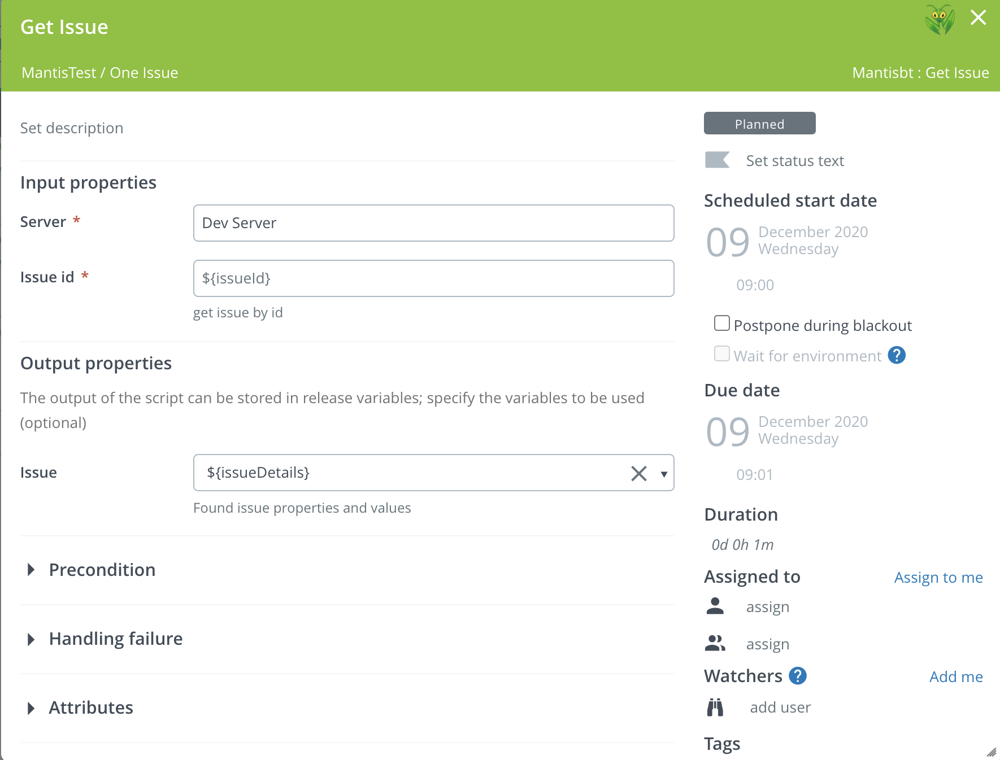
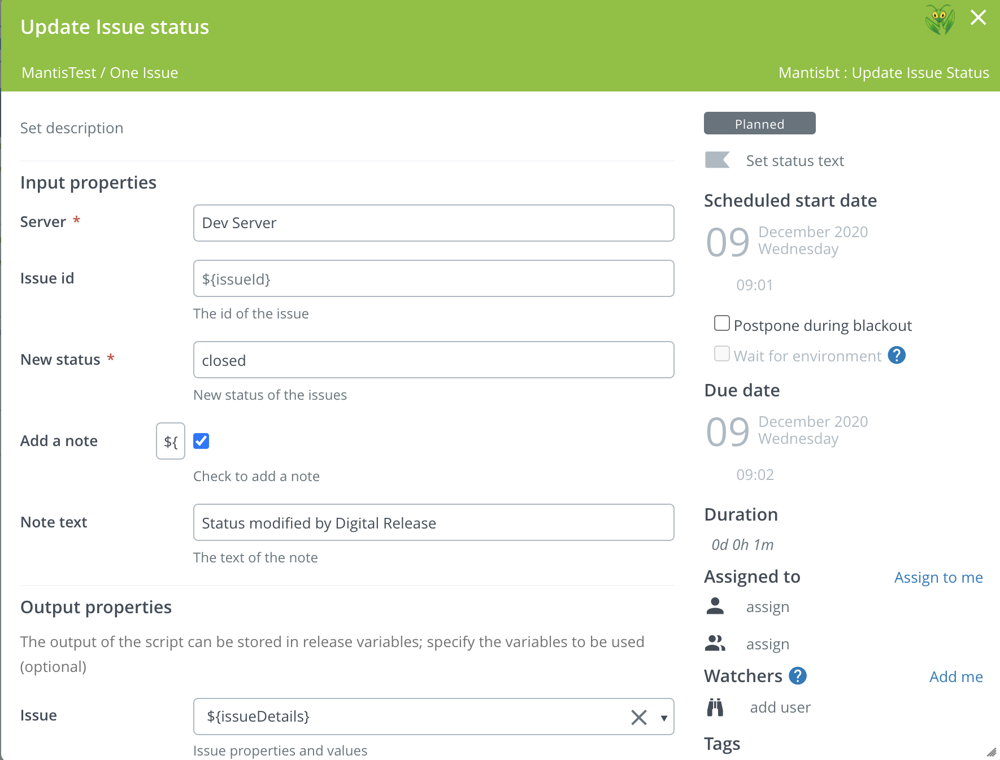
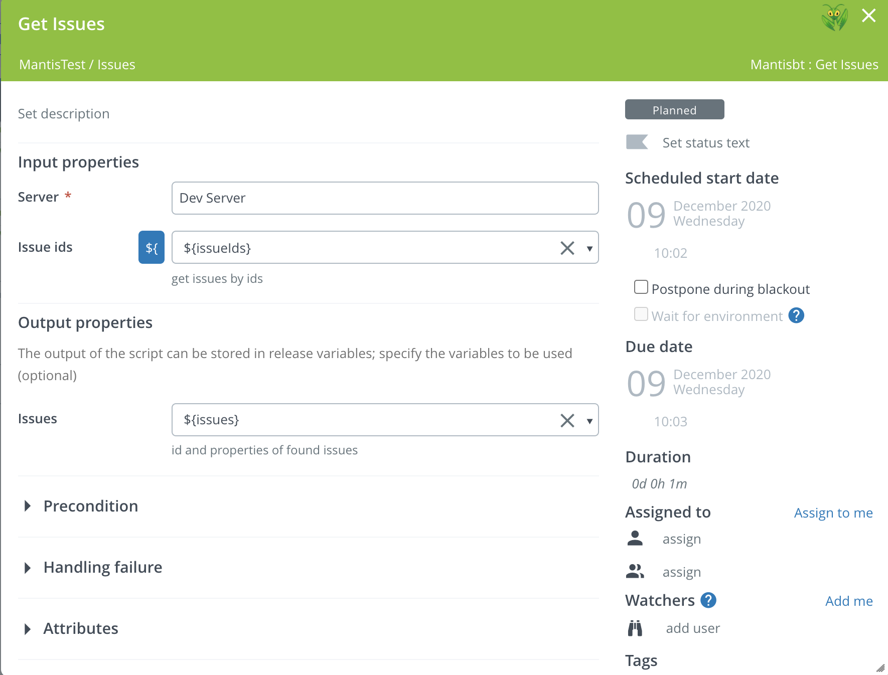
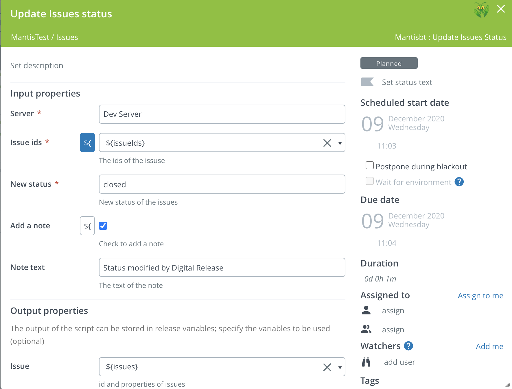
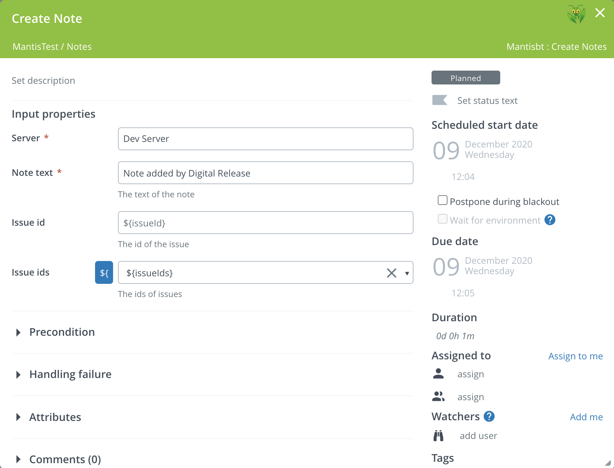
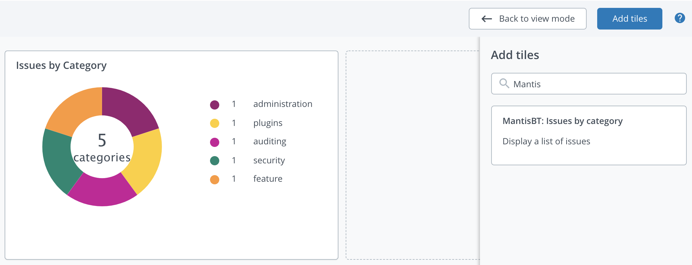
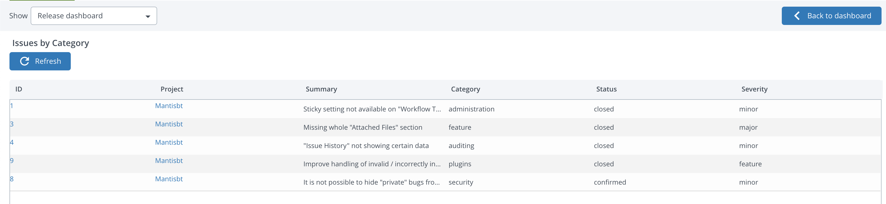

# XL Release Mantis Bug Tracker plugin

[![Build Status][xlr-mantisbt-plugin-travis-image]][xlr-mantisbt-plugin-travis-url]
[![License: MIT][xlr-mantisbt-plugin-license-image]][xlr-mantisbt-plugin-license-url]
![Github All Releases][xlr-mantisbt-plugin-downloads-image]

[xlr-mantisbt-plugin-travis-image]: https://travis-ci.org/xebialabs-community/xlr-mantisbt-plugin.svg?branch=master
[xlr-mantisbt-plugin-travis-url]: https://travis-ci.org/xebialabs-community/xlr-mantisbt-plugin
[xlr-mantisbt-plugin-license-image]: https://img.shields.io/badge/License-MIT-yellow.svg
[xlr-mantisbt-plugin-license-url]: https://opensource.org/licenses/MIT
[xlr-mantisbt-plugin-downloads-image]: https://img.shields.io/github/downloads/xebialabs-community/xlr-mantisbt-plugin/total.svg

## Preface

This document describes the functionality provided by the XL Release Mantis Bug Tracker plugin.

See https://www.mantisbt.org

See the [XL Release reference manual](https://docs.xebialabs.com/xl-release) for background information on XL Release and release automation concepts.

## Requirements

Note:  XLD or XLR version should not be lower than lowest supported version.  See <https://support.xebialabs.com/hc/en-us/articles/115003299946-Supported-XebiaLabs-product-versions>.

## Installation

* Copy the latest JAR file from the [releases page](https://github.com/xebialabs-community/xlr-mantisbt-plugin/releases) into the `RELEASE_SERVER/plugins` directory.
* Restart the XL Release server.

## Tasks

### Task: "Get Issue"

### Task: "Update Issue Status"

### Task: "Get Issues"

### Task: "Update Issues Status"

### Task: "Create Note"

### Tile "Issues by Category"

